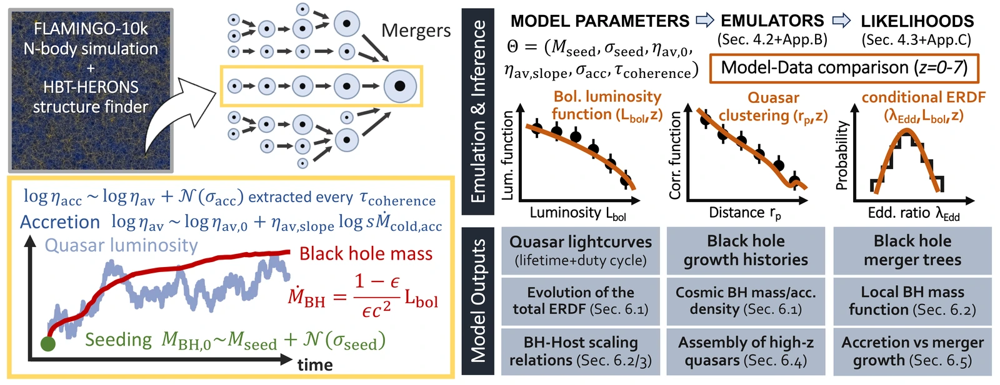

<p align="center">
  
  <br>
  <sub><em>A</em> bacaro <em>is a traditional Venetian wine bar.</em></sub>
</p>

# BAQARO

BAQARO (**Black hole Accretion and Quasar Activity in a Realistic Observational
framework**) is a semi-empirical model for the growth of supermassive black holes
and the quasar population they power, built on the subhalo merger trees of the
FLAMINGO-10k dark-matter-only simulation.

The model seeds a black hole in every halo as it enters the merger tree and
grows it through **stochastic** accretion tied to the cold-gas supply of its
host. The result is not smooth, deterministic tracks, but fluctuating episodes set by a
coherence timescale and an overall scatter. Six free parameters are fit jointly
to the bolometric quasar luminosity function, quasar clustering, and the
conditional Eddington-ratio distribution at fixed luminosity, over 0 ≲ z ≲ 7.

That stochasticity is the point: it is what lets rare billion-solar-mass black
holes emerge as outliers of the accretion-rate distribution while the bulk of
the population grows far more steadily.

<p align="center">
  
  <br>
  <sub>
    <b>The model end to end.</b>
    <i>Left:</i> FLAMINGO-10k merger trees, black hole seeding, and the stochastic
    accretion that sets both the mass growth and the quasar lightcurve.
    <i>Top right:</i> the six parameters, emulated and compared against the
    luminosity function, quasar clustering and the conditional ERDF.
    <i>Bottom right:</i> what the fitted model then predicts.
  </sub>
</p>

<p align="center">
  <b>Start at the website:
  <a href="https://eliapizzati.github.io/baqaro.html">eliapizzati.github.io/baqaro.html</a></b>
  <br>
  <sub>
    A walkthrough of the model with the six parameters on sliders and the
    emulator running live in the browser. Nothing to install, and the quickest
    way to see what the model actually does. Paper and data products:
    see <a href="#links">Links</a>.
  </sub>
</p>

> [!IMPORTANT]
> **The code is public; the data products are not out yet.** Summary statistics,
> portable emulators, posteriors and the quasar catalogue will follow upon acceptance of the paper, but are already available upon request. Until then the (heavy)
> runnable path is the forward model itself, straight from the public FLAMINGO-10k
> catalogues; see [Running from the FLAMINGO-10k merger trees](#running-from-the-flamingo-10k-merger-trees).


## NOTE The model: emulators vs catalogue ##

Two objects make "the model", and they answer different questions.

**The fiducial run** is one forward evaluation at the adopted best-fit
parameters, over the full FLAMINGO-10k catalogue: all 2.25 billion resolved halos
(of 3.24 billion tracks in the catalogue, a third of which never reach the
40-particle resolution cut), as a 16-node job. Nothing is interpolated, so it *is* the model, and it resolves
individual objects. It exists at one point in parameter space.

**The emulators** are Gaussian-process surrogates for the four summary
statistics (QLF, BHMF, cERDF, QHMF), good anywhere in the 6-D box in
milliseconds, but blind to individual objects.

| | Fiducial run | Emulators |
|---|---|---|
| Covers | one parameter set | anywhere in the 6-D box |
| Resolves | every object | four summary statistics |
| Costs | 16 nodes, 782 GB | milliseconds, ~1 MB |
| Approximates | nothing; it is the model | GP interpolation |

So the inference runs on the emulators, while anything per-object (clustering
by direct pair counting, quasar lightcurves, black hole growth and merger
histories) can only come from the fiducial run.

---

## What you can actually run

Be aware of this before you clone. Five things you might want, and they are not
equally ready:

| You want to… | You need | Status |
|---|---|---|
| **Understand the model**, and see how it responds to each of its parameters | a browser | **Yes**, at the [website](https://eliapizzati.github.io/baqaro.html). |
| **Predict the summary statistics** anywhere in the parameter box | a browser, or the emulator files | **Interactively yes**: the website runs the emulator live. The emulator files are not public yet. |
| **Read the posteriors, or query individual objects**: chains, the quasar catalogue, growth histories | `numpy`, `h5py`, and the data products | **Not yet.** Released once the paper is accepted; available on request before then. |
| **Re-run the forward model**: evolve the population from the merger trees | the FLAMINGO-10k halo catalogues, which are **public**, one large lookup table that this repository builds, and a cluster for the full-catalogue version | **Yes.** See [below](#running-from-the-flamingo-10k-merger-trees). |
| **Re-fit or re-emulate**: new likelihood, new priors, your own emulator | training data, which means running the row above once per parameter set | Yes, at that price. |

Those last two are heavy, and the full-catalogue forward run needs more than one
node. Costs are itemised below. But nothing in it is closed: the
FLAMINGO-10k catalogues are themselves a public data release, the one big
precomputed table is built by code in this repository, and every output file
records the exact parameters that produced it.

## Install

```bash
pip install -e .                 # core
pip install -e '.[clustering]'   # + Corrfunc, only for direct pair counting
pip install -e '.[test]'         # + pytest
```

Python ≥ 3.10. Dependencies are declared in `pyproject.toml` under PEP 621
`[project]`; `setup.py` is a compatibility shim. One dependency is not on PyPI
and is pinned by URL: [`qhtools`](https://github.com/eliapizzati/qhtools),
which supplies the physical constants, cosmology and clustering utilities used
throughout.

## Layout

| Directory | Role |
|---|---|
| `core_functions/` | The forward model: halo-history pipeline, seeding, ERDF, accretion engines, merger trees |
| `emulation/` | Training-set generation, GP+PCA emulator training, cross-validation |
| `inference/` | Likelihoods, priors, MCMC runners, results analysis |
| `obs_data/` | Loaders for every observational dataset entering the fit |
| `clustering_direct/` | Direct pair-counting clustering measurement (Corrfunc) |
| `utils/` | Paths, units, cosmology, run identity and provenance |
| `plotting_paper/` | The publication figure set |
| `plotting_common/` | Shared plotting infrastructure |
| `plotting_analysis/` | Standalone analysis figures |
| `tests/` | Test gates and diagnostic probes (see below) |

## Running from the FLAMINGO-10k merger trees

The halo catalogues this model is built on are themselves a **public data
release**: <https://dataweb.cosma.dur.ac.uk:8443/flamingo/>. The run used
throughout is **FLAMINGO-10K**, the 2.8 Gpc dark-matter-only box of roughly a
trillion particles, which this repository calls `L2800N10080`.

Only the HBT-HERONS merger trees are needed, one file per snapshot:

```
FLAMINGO/<box>/<run>/HBT-HERONS/OrderedSubSnap_{snap:03d}.hdf5
```

and only the `Subhalos/` group inside them: `TrackId`, `SinkTrackId`,
`DescendantTrackId`, `NestedParentTrackId`, `SnapshotIndexOfBirth`,
`SnapshotIndexOfDeath`, `SnapshotIndexOfSink`, `LastMaxMass`, plus
`ComovingAveragePosition` if you want the direct clustering measurement.
**No particle data at all**, which is why a 2.8 Gpc box is tractable here.
Download through the service's web file browser, or script it with the
`hdfstream` module documented under *How to use this service*.

**Where the code looks.** Three environment variables and one directory shape.
The built-in defaults are the authors' machines, so set all three:

```bash
export BAQARO_DATA_DIR=/path/to/your/data      # input catalogues (read)
export BAQARO_OUTPUT_DIR=/path/to/your/outputs # every product (written)
export BAQARO_PLOTS_DIR=/path/to/your/plots    # figures (written)
```

```
$BAQARO_DATA_DIR/HBT_runs_FLAMINGO/L2800N10080/
├── output_list.txt          # one redshift per line, index == snapshot number
└── HBT_compressed/
    ├── OrderedSubSnap_000.hdf5
    └── ...
```

`HBT_compressed/` is this repository's name for what FLAMINGO publishes as
`HBT-HERONS/`, so a symlink is enough. `output_list.txt` sits one level up, at
`FLAMINGO/<box>/<run>/`, and is one redshift per line, so its row index is the
snapshot number.

**The lookup table.** The accretion engine draws sums of lognormals from a
precomputed inverse-CDF table (~764 MB, far too large for git). Build it once;
it is pure computation and needs no external input:

```bash
python -m baqaro.core_functions.build_lognormal_sampler
```

It writes `Universal_Lognormal_Sampler_final.npz` into `transfer_functions/`
under the output path, and skips the build if the file is already there.

**Then** the halo-history pass, which everything downstream mmaps:

```bash
python -m baqaro.core_functions.halo_mass_histories_saver
```

**Then the forward model, by one of two routes.** They are different jobs, and
the difference is not a detail:

```bash
# (a) subsampled, one node: reproduces the summary statistics
python -m baqaro.core_functions.main_evolution

# (b) full catalogue, one node PER CHUNK: what the fiducial run is
BAQARO_USE_SUBSAMPLE=0 BAQARO_N_CHUNKS=16 BAQARO_CHUNK_ID=$SLURM_ARRAY_TASK_ID \
  python -m baqaro.core_functions.main_evolution_chunked
```

Route (b) splits the trees into 16 disjoint, merger-closed chunks, one per
node, and the per-chunk outputs are recombined afterwards (`concat_chunks.py`,
`pool_chunks.py`). **It cannot be run on a single machine**: unsubsampled z = 0
needs about 2.6 TB of RAM in one address space, which no ordinary node has.
Chunking is what makes the full catalogue reachable at all, and every per-object
product (the quasar catalogue, the merger catalogue) comes from it.

**Training data takes route (a), many times over.**
`emulation/main_training.py` evolves the same stratified subsample once per
parameter set. That is what makes a training set of thousands of runs
affordable; route (b) could not be repeated that many times. The emulators are
then fitted to those runs, so they inherit the subsample's reach, and with it the
caveat that the extreme massive/luminous tail is not sampled the way the full catalogue
samples it.

**What it costs**, for z = 0:

| Step | Where (example) | Wall | Peak RAM | Produces |
|---|---|---|---|---|
| Downloading the trees | your network | | | **1.4 TB** of columns, out of 8.0 TB of whole files |
| `halo_mass_histories_saver` (full-N, whether or not you subsample) | one 4 TB fat node | ~12 h | ~2.2 TB | **3.5 TB** of snapshot-major arrays plus merger trees |
| `main_evolution`, subsampled | one 2 TB node | ~1 h 40 m | ~700 GB | 425 GB HDF5, 386 M of the 2.25 B resolved halos |
| `main_evolution_chunked`, full | **16 nodes** of 1 TB, in parallel | up to 8 h per chunk | ~1 TB per node | **782 GB**: a 722 GB population file plus a 59 GB merger catalogue, all 2.25 B resolved halos |

The halo-history build is the awkward one. It holds the whole float32 mass
array over `(n_snapshots, n_halos)` in memory, plus a boolean mask a quarter
its size, so it peaks around 2.2 TB and will OOM a 1 TB node: it wants a
fat-memory machine, and ours asked for 2.7 TB. Its wall time is scaled from a
measured 3.4 h at z = 3 rather than timed at z = 0.

**The *Where* column records what these particular runs happened to use, not a
requirement.** What a step actually needs is the number in *Peak RAM*; how you
supply it is yours to choose. `BAQARO_N_CHUNKS` sets the split, so fewer and
larger nodes or more and smaller ones both work, with more chunks meaning fewer
halos per node and a smaller per-node footprint. Whatever you pick has to match
the SLURM array width.

Smaller redshifts are much cheaper, and a good way to check the setup before
committing to z = 0. A z = 6 run (`BAQARO_MAX_SNAP=39`) is 16 minutes and 75 GB;
z = 4 (`BAQARO_MAX_SNAP=50`) is 45 minutes and 361 GB.

## Running the pipeline

A bare invocation of any stage reproduces the adopted fiducial model with no
environment block; the defaults live in `utils/sim_config.py`. Overrides are
environment-driven and are encoded into the output filenames, so runs with
different physics can never collide on disk.

```bash
python -m baqaro.core_functions.main_evolution   # forward model
python -m baqaro.emulation.main_training         # training set
python -m baqaro.emulation.main_emulation        # emulators
python -m baqaro.inference.main_mcmc             # inference
```

Each stage reads what the previous one wrote: `main_training` evolves the
stratified subsample once per parameter set, `main_emulation` fits the
PCA + Gaussian-process emulators to those runs, and `main_mcmc` samples the
posterior against them. These are scripts, not modules: importing one raises
rather than silently starting a run.

The only input the chain does not build itself is observational: the
conditional-ERDF term of the likelihood reads the SDSS DR16Q quasar property
catalogue of Wu & Shen (2022), `dr16q_prop_May01_2024.fits` (3.1 GB, from the
SDSS data release), which goes at `$BAQARO_DATA_DIR/input_data/`. The smaller
observational tables are bundled under `obs_data/data/`, with their sources
listed in `obs_data/data/SOURCES.txt`.

Every output file carries a self-describing `provenance` group recording the
parameters, the git revision, the build time and the full environment of the
command that produced it. Prefer it over any documentation when you need to
know what a particular file on disk actually is.

## Tests

```bash
pytest
```

**Two kinds of file live in `tests/`:**

- `test_*.py` are **gates**: fast, assertion-based, safe to run unattended.
  These are what `pytest` collects.
- `diag_*.py`, `benchmark_*.py`, `validate_*.py` are **probes**: script-style,
  executing at import (plots, heavy compute, real simulation data). Run them
  directly, never through `pytest`.

The `*_test.py` **suffix** is deliberately excluded from collection in
`pyproject.toml`. A probe named that way gets imported during collection, runs
its whole body, and can block on a matplotlib window. Never name a file
`*_test.py`.

## Links

- **Website**: <https://eliapizzati.github.io/baqaro.html>, a walkthrough of the
  model with the emulator running live in the browser. Start here.
- **Paper**: *BAQARO: Tracing Stochastic Black Hole Growth Histories and
  Quasar Lightcurves in a Cosmological Context*, Pizzati, Hennawi & Schaye.
- **Data products** *(coming soon)*: summary statistics, portable emulators,
  MCMC chains, and a per-object quasar catalogue at 41 redshifts. Published once
  the paper is accepted, and available on request before then.
  They include a 20-line `numpy` reader for the emulators, so using those needs
  nothing from this repository.

## Citation

If you use BAQARO, please cite the model paper:

> Pizzati, E., Hennawi, J. F., & Schaye, J. (2026),
> *BAQARO: Tracing Stochastic Black Hole Growth Histories and Quasar
> Lightcurves in a Cosmological Context*, MNRAS submitted.

```bibtex
@article{baqaro2026,
  author  = {Pizzati, Elia and Hennawi, Joseph F. and Schaye, Joop},
  title   = {{BAQARO}: Tracing Stochastic Black Hole Growth Histories and
             Quasar Lightcurves in a Cosmological Context},
  journal = {Monthly Notices of the Royal Astronomical Society},
  year    = {2026}
}
```

If you use the data products, please cite their DOI as well once published.

**FLAMINGO-10k has its own terms**, which anything built on the halo catalogues
inherits: cite Schaye et al. (2023), Kugel et al. (2023) and Helly et al.
(2026), and include the Virgo Consortium acknowledgement text given on
[How to acknowledge use of this service](https://dataweb.cosma.dur.ac.uk:8443/flamingo/acknowledgements.html).
